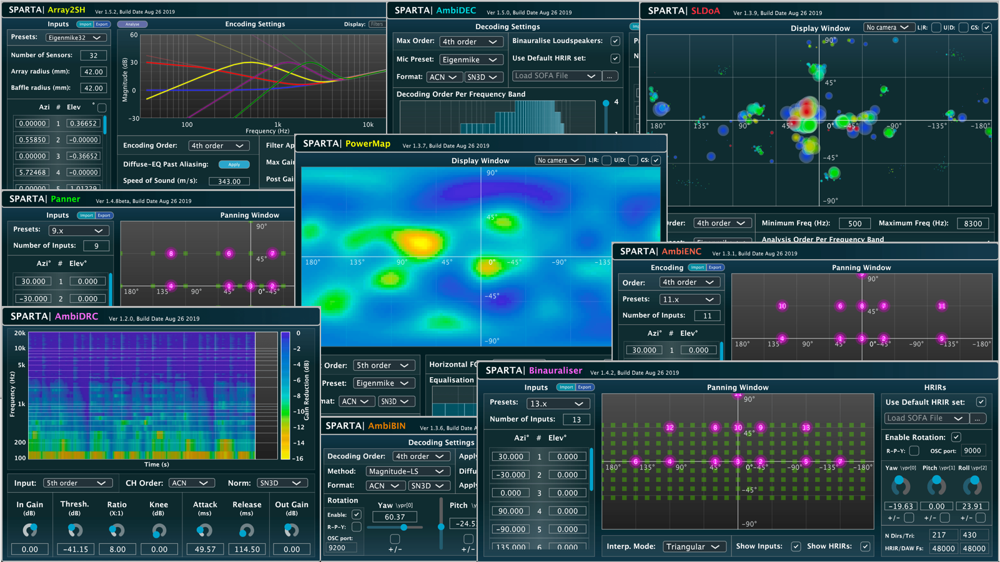

# SPARTA

SPatial Audio Real-Time Applications (SPARTA) [1]. A collection of VST audio plug-ins for spatial audio production, reproduction and visualisation. Developed using [JUCE](https://github.com/WeAreROLI/JUCE/) and the [Spatial_Audio_Framework](https://github.com/leomccormack/Spatial_Audio_Framework).



* [1] McCormack, L. and Politis, A., 2019. **SPARTA & COMPASS: Real-time implementations of linear and parametric spatial audio reproduction and processing methods**. In Audio Engineering Society Conference: 2019 AES International Conference on Immersive and Interactive Audio.

## Plug-in descriptions

This repository contains the following VST plug-ins:
* **AmbiBIN** - A binaural ambisonic decoder (up to 7th order) with a built-in SOFA loader and head-tracking support via OSC messages. Includes: Least-Squares (LS), spatial re-sampling (SPR), time-alignment (TA), and magnitude least-squares (Mag-LS) decoding options.
* **AmbiDEC** - A frequency-dependent loudspeaker ambisonic decoder (up to 7th order) with user specifiable loudspeaker directions (up to 64), which may be optionally imported via JSON configuration files. Includes: All-Round (AllRAD), Energy-Preserving (EPAD), Spatial (SAD), and Mode-Matching (MMD) ambisonic decoding options. The loudspeaker signals may also be binauralised for headphone playback.
* **AmbiDRC** - A frequency-dependent dynamic range compressor for ambisonic signals (up to 7th order). 
* **AmbiENC** - An ambisonic encoder/panner (up to 7th order), with support for up to 64 input channels; the directions for which may also be imported via JSON configuration files. 
* **Array2SH** - A microphone array spatial encoder (up to 7th order), with presets for several commercially available A-format and higher-order microphone arrays. The plug-in can also present objective evaluation metrics for the currently selected configuration.
* **Beamformer** - A spherical harmonic domain beamforming plug-in with multiple beamforming strategies (up to 64 output beams).  
* **Binauraliser** - A binaural panner (up to 64 input channels) with a built-in SOFA loader and head-tracking support via OSC messages.
* **DirASS** - A sound-field visualiser based on re-assigning the energy of beamformers. This re-assigment is based on DoA estimates extracted from "spatially-constrained" regions, which are centred around each beamformer look-direction. 
* **MatrixConv** - A basic matrix convolver with an optional partitioned convolution mode. The user need only specify the number of inputs and load the filters via a wav file.
* **MultiConv** - A basic multi-channel convolver with an optional partitioned convolution mode. Unlike "MatrixConv", this plug-in does not perform any matrixing. Instead, each input channel is convolved with the respective filter; i.e. numInputs = numFilters = numOutputs.
* **Panner** - A frequency-dependent 3-D panner using the VBAP method (up to 64 inputs and outputs).
* **PowerMap** - A sound-field visualisation plug-in based on ambisonic signals as input (up to 7th order), with PWD/MVDR/MUSIC/Min-Norm options.
* **Rotator** - A flexible ambisonic rotator (up to 7th order) with head-tracking support via OSC messages. 
* **SLDoA** - A frequency-dependent sound-field visualiser (up to 7th order), based on depicting the direction-of-arrival (DoA) estimates derived from spatially localised active-intensity vectors. The low frequency estimates are shown with blue icons, mid-frequencies with green, and high-frequencies with red. 

## Pre-built plug-ins

The plug-in suite may be downloaded from [here](http://research.spa.aalto.fi/projects/sparta_vsts/) [Mac OSX (10.10 or higher), Linux (x86_64), and Windows (64-bit)].

## Building the plug-ins yourself

First clone the repository (including submodules) with:

```
git clone --recursive https://github.com/leomccormack/SPARTA
# or if you have already cloned the repository, update with
git submodule update --init --recursive
```

## Prerequisites 

The [VST2_SDK](https://web.archive.org/web/20181016150224/https://download.steinberg.net/sdk_downloads/vstsdk3610_11_06_2018_build_37.zip) must first be placed in the 'SDKs' folder like so:

```
SDKs/VST2_SDK
```

**MacOSX, Windows and Linux (x86_64/amd64) versions**: also require a custom Intel MKL library. Details on how to acquire this library may be found [here](https://github.com/leomccormack/Spatial_Audio_Framework/blob/master/CUSTOM_INTEL_MKL_INTRUCTIONS.md). 

**Raspberry Pi (ARM) versions** instead require OpenBLAS and LAPACKE libraries:

```
sudo apt-get update
sudo apt-get install liblapack3 liblapack-dev libopenblas-base libopenblas-dev liblapacke-dev
```

**Linux (amd64/ARM) users** must also install the following libraries (the former line for JUCE, the latter line for the Spatial_Audio_Framework):

```
sudo apt-get install x11proto-xinerama-dev libwebkit2gtk-4.0-dev libgtk-3-dev x11proto-xext-dev libcurl4-openssl-dev libasound2-dev
sudo apt-get install libhdf5-dev libnetcdf-dev libnetcdff-dev
```

## Building the plug-ins

When saving the .jucer files with the Projucer App, Visual Studio (2015/2017) solutions, Xcode project files, Linux Makefiles (amd64), and Raspberry Pi Linux Makefiles (ARM) are placed in:

```
audio_plugins/_SPARTA_X_/make/
```

To generate project files for other IDEs, you may open and configure the included .jucer files accordingly.

## Batch building 

**Linux/MacOSX users** may run the included "audio_plugins/build-plugins.sh" script via the Terminal, to build all plug-ins:

```
bash build-plugins.sh all
```

**Windows users** may run the included "audio_plugins/build-plugins.bat" script (with "x64 Developer Command Prompt for VS.exe"), to build all plug-ins:

```
build-plugins.bat <path/to/Projucer.exe>
```

## Known issues

* Linux versions are quite experimental, but have been tested and largely work for us (we have experienced some graphical glitches, but these are consistent with other JUCE-made plugins).  However, please report any weird behaviour. 
* Raspberry PI versions are also quite experimental, and experience some graphical glitches, but are mostly working. 
* Due to missing code in the JUCE framework: on MacOSX, the camera ID cannot be changed for the visualisation plugins. And on Linux, the camera cannot be used at all.

Please let us know if you encounter any other issues (contact via email: leo.mccormack@aalto.fi, or raise a github "issue").

## Contributing

Suggestions and contributions to the code are both welcomed and encouraged. Feel free to branch off the 'develop' branch and submit pull requests. Note, however, that if the changes/additions are major, then consider first discussing it via a github "issue" or by contacting the developers directly via email. We may also be able to help in the implementation if needed.

## Developers

* **Leo McCormack** - C/C++ programmer and algorithm design (contact: leo.mccormack(at)aalto.fi)
* **Symeon Delikaris-Manias** - algorithm design
* **Archontis Politis** -  algorithm design
* **Ville Pulkki** - algorithm design

## License

This project is licensed under the GPLv3 License - see the [LICENSE](LICENSE) file for details
